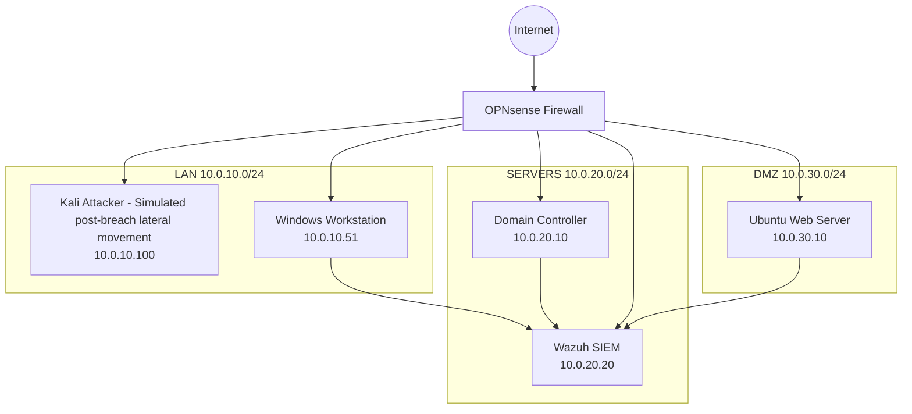
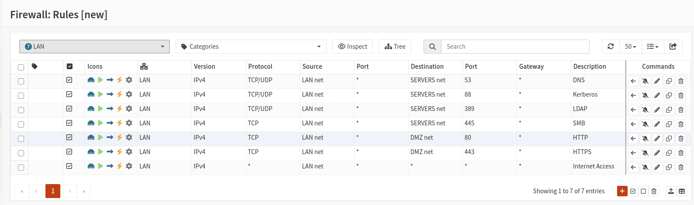
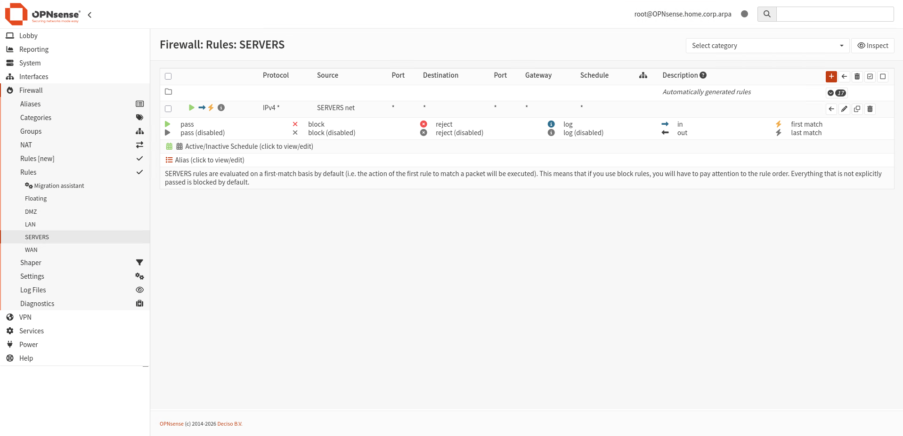
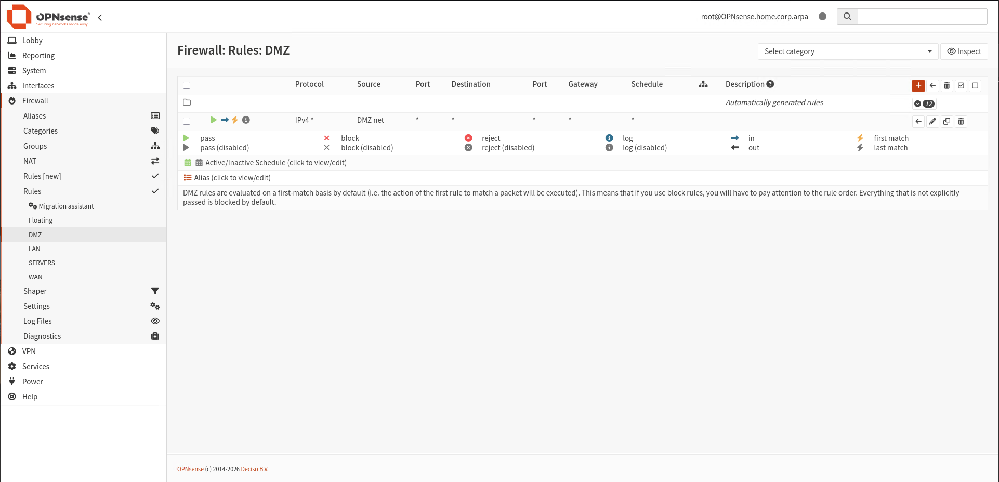
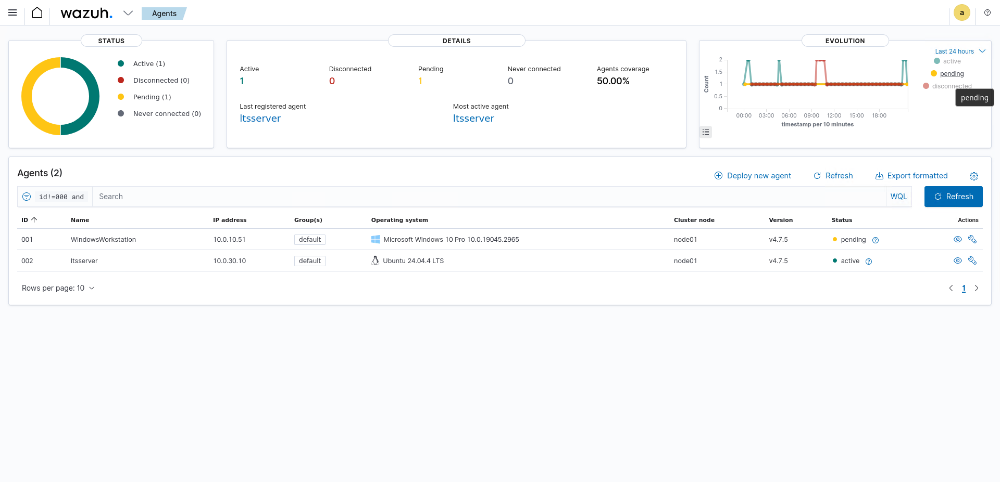
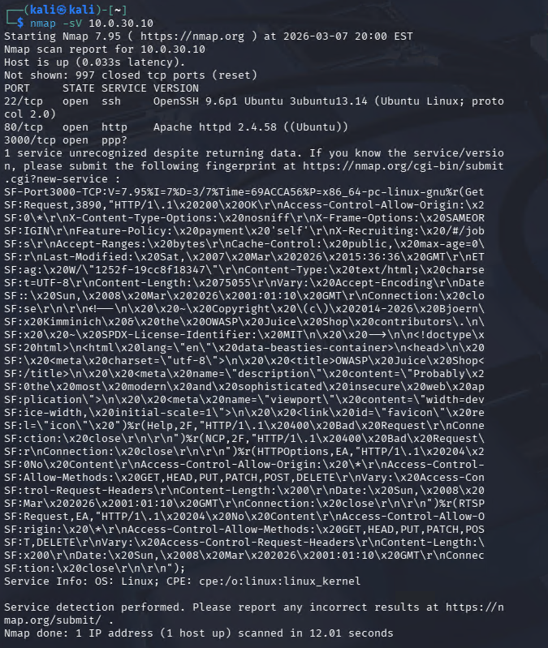
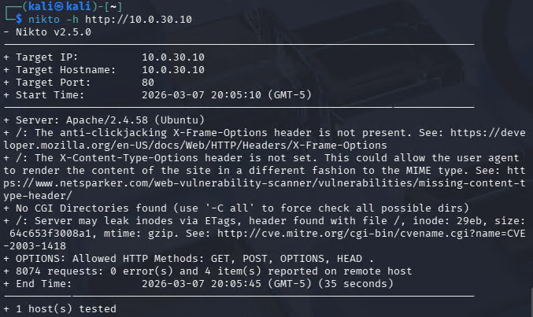
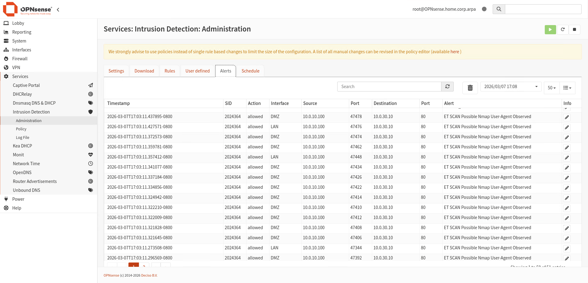
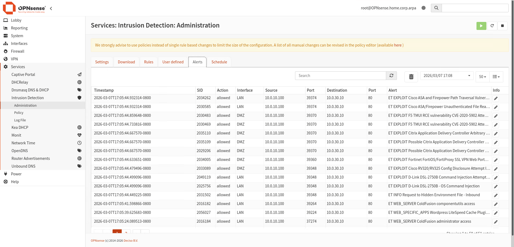
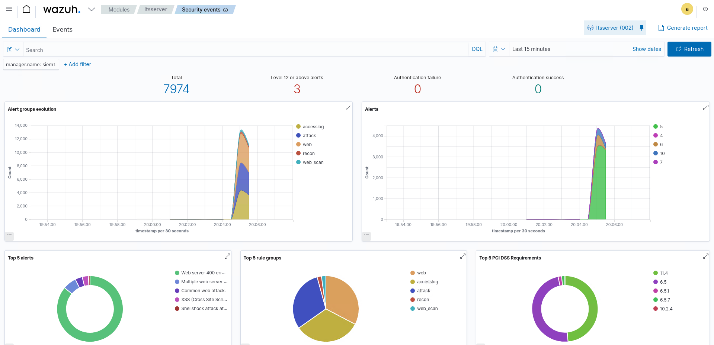

# Enterprise Datacenter Lab

## Overview

This project documents the design and implementation of a **mini
enterprise cybersecurity lab environment** built in a home lab using
virtualization via VirtualBox.

## Host Machine

| Component | Spec |
|-----------|------|
| CPU | Intel i5-13600KF |
| RAM | 32 GB |

## Virtual Machines

| VM | Role | Network |
|----|------|---------|
| OPNsense | Firewall | All segments |
| Windows Server | Domain Controller | SERVERS |
| Windows Workstation | Domain endpoint | LAN |
| Ubuntu Server | DMZ web server | DMZ |
| Wazuh SIEM | Security monitoring | SERVERS |
| Kali Linux | Attack simulation | LAN |

The objective of the lab is to simulate a realistic corporate network
with segmentation, identity management, security monitoring, and attack
detection.

The lab includes:

-   **Enterprise-style network segmentation**
-   **Active Directory domain infrastructure**
-   **DMZ web server deployment**
-   **SIEM monitoring with Wazuh**
-   **Intrusion detection using Suricata**
-   **Attack simulation using Kali Linux**

This environment allows hands-on practice with **network security, SOC
monitoring, incident analysis, and attack detection workflows**.

------------------------------------------------------------------------

# Network Architecture

The environment is segmented into three core networks:

  Network  | Purpose                              | Subnet
  ---------|--------------------------------------|--------------
  LAN      | User devices and attacker simulation |  10.0.10.0/24
  SERVERS  | Infrastructure services              |  10.0.20.0/24
  DMZ      | Public-facing services               |  10.0.30.0/24

Firewall gateways:

LAN -- 10.0.10.1\
SERVERS -- 10.0.20.1\
DMZ -- 10.0.30.1

------------------------------------------------------------------------

------------------------------------------------------------------------

# Technologies Used

  Technology      |Purpose
  ----------------|------------------------------------
  OPNsense        |Firewall / network segmentation
  Windows Server  |Active Directory Domain Controller
  Ubuntu Server   |DMZ web server
  Apache          |Web service hosting
  Wazuh           |SIEM platform
  Suricata        |Intrusion detection
  Kali Linux      |Attack simulation
  VirtualBox      |Virtualization platform

------------------------------------------------------------------------

# Project Implementation

## Phase 1 -- Network Architecture

Designed a segmented network environment to simulate enterprise
infrastructure.

Networks created:

-   LAN (10.0.10.0/24)
-   SERVERS (10.0.20.0/24)
-   DMZ (10.0.30.0/24)

This segmentation separates internal user systems, infrastructure
servers, and externally exposed services.

------------------------------------------------------------------------

## Phase 2 -- Firewall Deployment

Installed and configured **OPNsense firewall**.

Interfaces configured:

WAN -- DHCP\
LAN -- 10.0.10.1\
SERVERS -- 10.0.20.1\
DMZ -- 10.0.30.1

The firewall provides routing, NAT, and network isolation.

Firewall configuration for the LAN network:

Firewall configuration for the SERVERS network:

Firewall configuration for the DMZ network:

------------------------------------------------------------------------

## Phase 3 -- Network Services

Configured DHCP services on OPNsense for each subnet.

Example DHCP ranges:

LAN -- 10.0.10.50--100\
SERVERS -- 10.0.20.50--100\
DMZ -- 10.0.30.50--100

This allows automated IP address allocation for network hosts.

------------------------------------------------------------------------

## Phase 4 -- Active Directory Deployment

Deployed **Windows Server Domain Controller**.

Domain created:

corp.home.arpa

Domain Controller:

dc1 -- 10.0.20.10

Services deployed:

-   Active Directory Domain Services
-   DNS
-   Group Policy

------------------------------------------------------------------------

## Phase 5 -- Domain Workstation

A Windows workstation was deployed and successfully joined to the
domain.

Example domain login:

CORP`\alice`

This verified that domain authentication and DNS resolution were
functioning correctly.

------------------------------------------------------------------------

## Phase 6 -- DMZ Server Deployment

Deployed Ubuntu Server in the DMZ network.

Configuration:

Hostname -- web1\
IP -- 10.0.30.10

Installed Apache web server to simulate a public-facing web service.

------------------------------------------------------------------------

## Phase 7 -- Group Policy Security

Implemented baseline security policies within Active Directory.

Examples include:

-   Password complexity enforcement
-   Account lockout policies
-   Domain security baseline configuration

These policies simulate enterprise endpoint security management.

------------------------------------------------------------------------

## Phase 8 -- DMZ Application Deployment

Configured web services on the DMZ server.

Applications installed:

-   Apache
-   Vulnerable web applications (DVWA / Juice Shop)

These applications provide targets for attack simulation and
vulnerability testing.

------------------------------------------------------------------------

## Phase 9 -- SIEM Deployment

Installed **Wazuh SIEM** on an internal server.

SIEM Server:

10.0.20.20

Connected monitored systems:

-   Ubuntu DMZ server
-   Domain systems
-   Firewall logs

This enables centralized log analysis and security event monitoring.

Wazuh SIEM Connected Agents, Focused on the LTS Server (Linux Web Server)

------------------------------------------------------------------------

## Phase 10 -- Attack Simulation

Deployed Kali Linux attacker system.

Attacker host:

10.0.10.100

Attack simulations performed:

-   Network reconnaissance using Nmap
-   Web vulnerability scanning using Nikto
-   Directory enumeration
-   Credential brute-force attempts

These activities generate detectable events within the SIEM.

A network reconnaissance being performed by Nmap on the Linux Web Server:

A web vulnerability scan being run by Nikto on the Linux Web Server:

------------------------------------------------------------------------

## Phase 11 -- Intrusion Detection

Enabled Suricata IDS within OPNsense.

Detection rules include:

-   Port scan detection
-   Exploit signatures
-   Web attack signatures
-   Malware traffic indicators

Suricata analyzes network traffic in real time and generates alerts when
malicious patterns are detected.

This Suricata alert was triggered by the Nmap scan in Phase 10:

This Suricata alert was triggered by the web vulnerability scan performed by Nikto in Phase 10:

The Wazuh dashboard triggering alerts for the Nikto scan performed in Phase 10:

------------------------------------------------------------------------

# Security Monitoring Workflow

Example detection process:

1.  Attacker runs scan from Kali
2.  Traffic passes through OPNsense
3.  Suricata analyzes packets
4.  Events logged in Wazuh SIEM
5.  Security alerts appear in monitoring dashboard

This workflow simulates real **Security Operations Center (SOC)
monitoring processes**.

------------------------------------------------------------------------

# Skills Demonstrated

This project demonstrates experience with:

-   Network segmentation
-   Firewall configuration
-   Active Directory administration
-   DMZ architecture
-   SIEM deployment
-   Intrusion detection systems
-   Attack simulation
-   Security monitoring workflows

------------------------------------------------------------------------

# Future Improvements

Potential enhancements include:

-   Vulnerability scanning with OpenVAS
-   Endpoint detection and response tools
-   Threat intelligence integration
-   Automated attack detection rules
-   Blue team incident response scenarios

------------------------------------------------------------------------

# Conclusion

This lab environment provides a **realistic enterprise cybersecurity
simulation** for practicing network defense, monitoring security events,
and analyzing attack activity.

The environment demonstrates the interaction between **attack techniques
and defensive monitoring systems**, closely resembling a small-scale
enterprise SOC environment.
